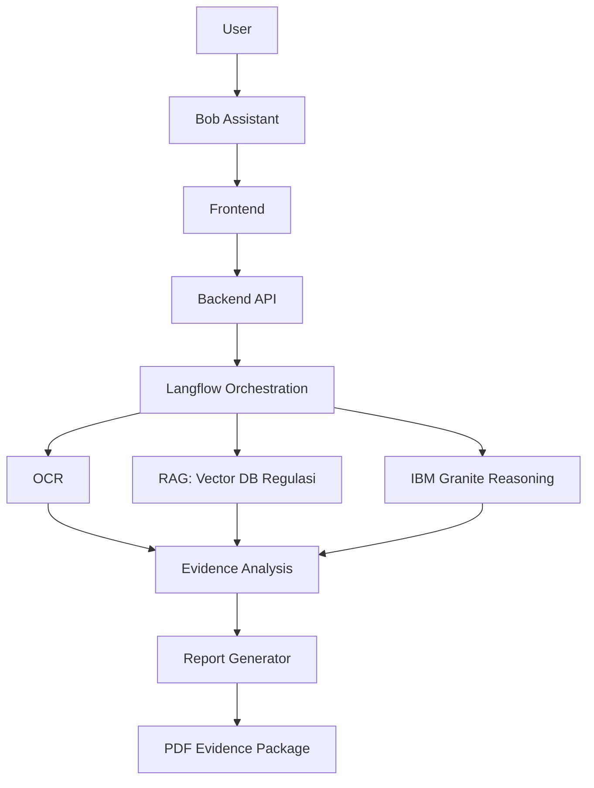

# BuktiTagih AI

**Ubah bukti penagihan pinjol yang berantakan jadi paket bukti terstruktur, siap dilaporkan.**

BuktiTagih AI adalah platform *digital evidence intelligence* untuk korban penagihan pinjaman online bermasalah. Upload screenshot chat, riwayat panggilan, dan bukti pembayaran. Sistem mengekstrak isinya, mengklasifikasikan jenis pelanggaran, mencocokkannya dengan regulasi, lalu membuat laporan PDF yang bisa diserahkan ke OJK, AFPI, lembaga bantuan hukum, atau kuasa hukum.

> Dibuat untuk **IBM SkillsBuild University Education National Hackathon 2026**.
> Status: MVP dalam pengembangan.

> [!IMPORTANT]
> BuktiTagih AI membantu menata bukti. Sistem ini **bukan** nasihat hukum dan tidak menggantikan lembaga atau profesional hukum.

---

## Kenapa ini ada

Korban penagihan bermasalah biasanya punya banyak bukti, tapi tersebar: screenshot WhatsApp, call log, bukti bayar. Mereka juga jarang tahu aturan mana yang dilanggar dan bagaimana menyusun laporan. Menurut OJK, ada 56.620 pengaduan konsumen sepanjang 1 Januari–28 Desember 2025, dan 21.886 di antaranya dari sektor fintech.

BuktiTagih AI mengerjakan bagian yang paling melelahkan: memilah bukti, mencari dasar regulasi, dan menyusun laporan.

## Fitur

- **Upload bukti**: gambar dan PDF (screenshot chat, call history, bukti pembayaran).
- **OCR dan ekstraksi entitas**: aktor, korban, waktu, nomor telepon, organisasi, lokasi, dan kejadian kunci.
- **Klasifikasi pelanggaran**: `NORMAL`, `HARASSMENT`, `THREAT`, `DATA_EXPOSURE`, `SPAM`, lengkap dengan severity dan confidence.
- **Pencocokan regulasi (RAG)**: referensi diambil dari knowledge base regulasi (POJK, AFPI, UU PDP). Model hanya boleh menyimpulkan dari konteks yang diambil.
- **Laporan PDF**: paket bukti berisi temuan, alasan, dan referensi regulasi.
- **Bob**: asisten percakapan yang meminta bukti dan menjelaskan hasil dalam bahasa awam.

## Cara kerja



Ada dua pipeline:

**Offline: membangun knowledge base regulasi** (dijalankan sekali, dan ulang tiap ada regulasi baru)

`File Loader → PDF Parser → Text Cleaner → Text Splitter → Metadata Formatter → Embedding → Vector DB`

Chunk 700 token dengan overlap 150 token. Metadata per chunk: `source, category, topic, title, page, content, keywords`.

**Online: analisis bukti** (dijalankan tiap user submit bukti)

`File Input → OCR → Cleaning → Entity Extraction → Violation Classification → Retriever → IBM Granite Reasoning → JSON → PDF`

## Tech stack

| Lapisan | Teknologi |
|---|---|
| Frontend | React / Next.js |
| Backend | Evidence API, file storage |
| Orkestrasi AI | Langflow |
| LLM | IBM Granite |
| Retrieval | Vector database + embedding model |
| Ingestion regulasi | Unstructured.io, LlamaIndex, PyMuPDF |
| Output | PDF report generator |

## API

| Endpoint | Request | Response |
|---|---|---|
| `POST /evidence/upload` | `file`, `user_id` | `evidence_id`, `upload_status` |
| `POST /analysis/start` | `evidence_id` | `analysis_id`, `status` |
| `GET /analysis/{id}` | - | `category`, `severity`, `evidence`, `regulation_reference`, `confidence` |
| `GET /report/{id}` | - | File PDF |

`user_id` adalah identifier anonim/session. MVP tidak memakai akun terdaftar.

Contoh bentuk output analisis:

```json
{
  "category": "THREAT",
  "severity": "HIGH",
  "evidence": "Kalau tidak bayar hari ini, kami sebar data keluarga kamu.",
  "regulation_reference": "<referensi dari hasil retrieval>",
  "confidence": 0.0
}
```

> `regulation_reference` dan `confidence` di atas hanya placeholder. Nilainya dihasilkan sistem saat runtime.

## Struktur repository

```
BuktiTagih-AI/
├── frontend/         # components, pages, services, assets
├── backend/          # api, database, services, utils
├── langflow/         # evidence_analysis_flow, regulation_rag_flow
├── knowledge_base/   # raw_documents, processed_documents, embeddings
├── prompts/          # extraction, classification, reasoning
├── tests/            # evidence_cases, evaluation_results
└── docs/             # architecture, api, demo_script
```

## Menjalankan project

> Bagian ini perlu disesuaikan dengan setup tim. Isi sesuai stack yang sebenarnya dipakai.

```bash
# 1. Clone
git clone https://github.com/<username>/BuktiTagih-AI.git
cd BuktiTagih-AI

# 2. Environment
cp .env.example .env
# isi: kredensial IBM Granite, endpoint Langflow, konfigurasi vector DB

# 3. Backend
cd backend
# <perintah install dan run backend>

# 4. Frontend
cd ../frontend
# <perintah install dan run frontend>

# 5. Langflow
# import flow dari folder /langflow
```

## Target kualitas MVP

| Metrik | Target |
|---|---|
| F1 ekstraksi entitas | ≥ 0,90 |
| Recall klasifikasi pelanggaran | ≥ 0,90 |
| Kebocoran PII pada test set | 0 |
| Waktu proses 100 pesan | ≤ 3 menit |
| Keterlacakan | Setiap temuan terhubung ke bukti spesifik dan referensi regulasi |

Ini adalah target, bukan hasil pengujian.

## Roadmap

- [x] Desain arsitektur dan alur AI
- [ ] Pipeline Langflow + IBM Granite
- [ ] OCR, ekstraksi entitas, klasifikasi
- [ ] Knowledge base regulasi (RAG)
- [ ] UI, laporan PDF, alur Bob
- [ ] Pengujian dan demo

## Tim

| Peran | Fokus |
|---|---|
| AI Workflow Engineer | Langflow, IBM Granite, RAG, prompt engineering, AI testing |
| Product Engineer | Backend, upload, database, frontend, PDF report, antarmuka Bob |

## Privasi

Bukti penagihan memuat data pribadi. Jangan commit screenshot, dokumen, atau data korban asli ke repository ini. Gunakan data dummy untuk pengembangan dan pengujian.

## Lisensi

<!-- Pilih lisensi, mis. MIT, lalu tambahkan file LICENSE -->
